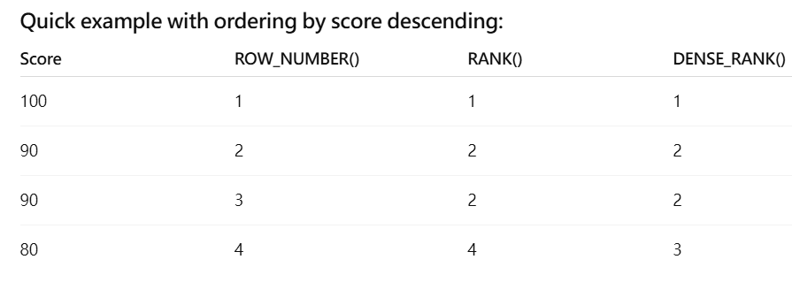
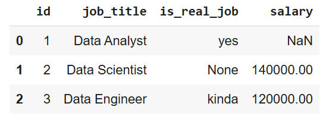
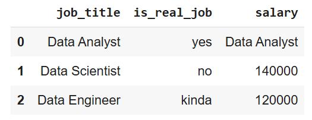
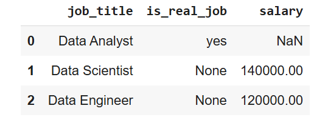

# Overview 
## Welcome to my Intermediate SQL Project!!! 

### For those already familiar with the fundamentals of SQL, this project serves as a transition into more advanced SQL concepts. It begins with setting up a database in Visual Studio Code, utilizing a connection to pgAdmin 4 for database management.
### The datasets used in this analysis are sourced from Luke Barousse's Intermediate SQL Course, which offers structured data tables and comprehensive information designed to support SQL-based data analysis.
[(Luke Barousse Intermediate SQL Source)](https://github.com/lukebarousse/Int_SQL_Data_Analytics_Course)

### Let start with the QUERY Clauses of which we learned from the basics of SQL:
- SELECT(DISTINCT)
- FROM
- WHERE
- **GROUP BY**
- HAVING 
- ORDER BY
- **JOINS**
- LIMIT
- **AGG FUNCTION (MAX, MIN, COUNT, SUM)** 
- CASE WHEN statement
- UNION
### However, to prepare for more advanced SQL skills that we will be using in the workspace and covering here in the future, we will focus on the following:
- **CTE**
- **Subquery**
- ROW NUMBER
- DATES (DATE_TRUNC, EXTRACT, TO_CHAR)
- **Window Function (Over Partition)**
- RANKING
- CONCAT
- EXPLAIN and EXPLAIN ANALYZE
- COALESCE/NULLIF

## Main Tools:
- **SQL(Structured Query Language)**: for interacting and communicating with relational databases
- **PostgreSQL**: The database management system, ideal for handling the job posting data
- **pgAdmin 4**: It's a graphical user interface (GUI) tool for managing PostgreSQL databases
- **Google Collab**: A free platform/tool for writing and executing SQL. No setup requried, with easy save and load notebooks from Drive.  
- **Visual Studio Code**: A powerful, lightweight, and highly customizable code editor that works great for a wide range of tasks. Contains connection with Github directly for users to upload their files. 
- **Github** - A platform that hosts Git repositories to store, share, and back up online.

## Create View 
🖥️ Query: [Q0_Create_view](Q0_Create_View.sql)
- Combining data table from sales and customer tables into revenue metrics
- Obtaining the first purchased date from each customer
- Getting the cohort year based on their first purchased date for the company
- Including customer's info such as name, age, and country
- Creating a view of this whole query that including customer and purchase info

## Project Analysis
## 1. Customer Segmentation: Who are our most valuable customers?
🖥️ Query: [Q1 Customer Segmentation](Q1_Customer_Segmentation.sql)  

- Finding each customer lifetime value (LTV)  
(LTV: Customer total spent for the company)
- Assigned Customer in Low, Mid, and High value based on their LTV
- Using such info to assist us to understand all customer purchase behavior(how much spent?)


### The Low, Mid, High Values Comparison Line based on 25% and 75% of the total ltv


###  Categorize the total LTV (Adds up)
🖥️ Query: [Q1 Different Value Total LTV](Q1_Different_Value_Total_LTV_Bonus.sql)  

## 📈 Visualization:


### 📊Key Observations:
- High-value segment (25% of customers) drives 66% of revenue ($135.4M)
- Mid-value segment (50% of customers) generates 32% of revenue ($66.6M)
- Low-value segment (25% of customers) accounts for 2% of revenue ($4.3M)


## 2. Cohort Analysis
🖥️ Query: [Q2 Cohort Analysis](Q2_Cohort_Analysis.sql)  
 
★ Calculating every customer first order behavior:
```sql
WHERE orderdate = first_purchase_date 
```
## 📊Visualization

## Graph Analysis
### (1). Total Revenue(1e7) vs. Total Customers by Cohort Year
### Observation:

- Total Revenue increases consistently from 2015 to 2019.

- A huge drop of the total revenue and customers from 2019~2020, but rises up the next year to 2022

- Another huge decline form 2022~2024

- Total Customers also grows steadily over the same period, nearly tripling from ~2800 to ~7700+.

### Insight:

- The rising trend in both metrics suggests strong customer acquisition and revenue growth.

- The decline observed between 2019 and 2020 may be attributed to the impact of the COVID-19 pandemic.

- While the decline between 2019 and 2020 may be due to the effects of the COVID-19 pandemic, the significant downturn observed from 2022 to 2024 could be indicative of decreased revenue and a shrinking customer base. 


### (2). Customer Revenue vs. Total Customers by Cohort Year
###  Observation:

- Customer Revenue (i.e., revenue per customer) fluctuates slightly but remains relatively stable, ranging between ~2560 and ~2890.

- Despite growing total customers, the customer revenue doesn’t increase substantially, and even dips slightly in 2018.

- A key observation in 2024 is that, despite a smaller customer base, the average revenue per customer remains high—indicating that these customers are particularly valuable and contribute significantly to the company's earnings.

### Insight:

- While the business is scaling in customer count, the average revenue per customer is not significantly increasing.

- This could indicate market saturation, pricing stability, or a consistent product/service offering without upselling or increased customer engagement.

- Although the company is experiencing a decline in its customer base, the average revenue has remained relatively stable, suggesting that the remaining customers are highly engaged and continue to generate substantial value.


## 3. Customer Retention: Which customers haven't purchased recently?
🖥️ Query: [Q3 Customer Retention](Q3_Customer_Retention.sql)


## 📊 Graph Analysis: Active vs Churned Customers (2015–2023)
### 1. Overall Trend
- Across all cohort years, a **significant majority of customers are churned**, while only a **small proportion remains active**.

- The **active customer percentage consistently ranges between 6% and 10%**, indicating a relatively low long-term retention rate.

### 2. Active Customers
- Although the number of active customers slightly increases in later cohorts (e.g., 2022, 2023), this is largely **due to the larger total customer base** rather than improved retention.

- The **peak in active customer count** (not percentage) occurs in **2023**, reflecting more recent customer acquisition but not necessarily higher engagement or loyalty.

### 3. Churned Customers
- Churned customer numbers closely follow the total customer count pattern, showing the **dominance of churn** in every year.

- For instance, in earlier cohorts like 2015–2017, churned customers made up **over 90%** of the cohort.

### 4. Implications
- The consistently low retention percentage suggests that **customer engagement or satisfaction might need improvement**.

- The **high churn rate** implies either short-term customer relationships or potential gaps in product/service stickiness.

- Despite the increasing total customer base over time, the low retention rate limits long-term revenue sustainability unless offset by acquiring high-value customers (as seen in the customer revenue chart you analyzed earlier).


## 4. Rankings Concept
 
--> For this section, we aim to explore the concepts of ranking methods and examine various types of rankings, concluding with a problem to apply the understanding.

### 1. ROW_NUMBER()
- **Definition**: Assigns a unique sequential integer to each row within a partition of a result set, starting at 1.

- **Key point**: No ties — each row gets a distinct number, even if values in ordering columns are the same.

- **Use case**: When you want to uniquely number rows, for example to pick the "first" row per group, or limit results with precise order.

### 2. RANK()
- **Definition**: Assigns a rank to each row within a partition of a result set. Rows with the same ordering values get the same rank, but gaps appear in the ranking after ties.

- **Key point**: Ties share the same rank, and the next rank skips numbers accordingly.

- **Use case**: When you want to rank items but show gaps after ties, e.g., ranking competitors where tied scores share the same rank but the next rank is adjusted.

### 3. DENSE_RANK()
- **Definition**: Similar to RANK(), but no gaps in ranks after ties.

- **Key point**: Ties share the same rank, and the next rank increments by 1 without skipping numbers.

- **Use case**: When you want to rank items with ties but want continuous ranks without gaps, e.g., leaderboard positions where tied players share a rank but the next player is ranked immediately after.  



### Example Problem
- Explaination: We are tyring to find each months' total orders and customers from '2015-01-01' ~ '2024-04-01'.

- Next, we apply the various ranking methods described above to rank the data. 

- (Key Part): "From the query below, you may observe multiple rows displaying the same year-month format, such as 2024-04-01, because there are multiple orders and customers within that month. Therefore, the date does not necessarily represent the first day of each month."
 
🖥️ Query: [Q4 Rankings](Q4_Rankings.sql) 

## A Brief Visualized Trend with the Total Order vs Total Customers


## Analysis 
### Parallel Growth Trend:
Both total orders and user count(customer count) follow a similar upward or downward trend across the cohort years, suggesting that customer acquisition and order volume are closely related(**how many orders how many customers**).

### Notable Peaks:
Some cohort years (e.g., 2022) show significantly higher values for both metrics, indicating possible business growth, marketing campaigns, or seasonal demand. In other words, in average, there were more customers had more than one orders. 

### Consistency:
The lines remain relatively close together, implying that the average number of orders per user is fairly consistent year-over-year.

### Insight Opportunity:
If there’s a year where the gap between total orders and user count widens, it may point to increased engagement (users placing more orders) or alternatively, fewer users placing many orders.

## 5. Case Statement (Review)

Although we had covered the CASE statement in the basics of SQL, I later realized its significant importance and frequent use in real-world professional work. So, why not create an example to test our level?  

### Question: Categroize each store with its size(sqauremeters) and revenue. (If size is Null, then it's Online Store)
🖥️ Query: [Q5 Case Statement](Q5_Case_Statement.sql)  

## Visualization


## Analysis:
The distribution of store categories by size and revenue shows clear dominance in the medium store segment. In particular:

- **Medium Store** – Low Revenue (15.55%) and Medium Store – High Revenue (13.04%) together make up nearly 29% of the total, indicating that medium-sized outlets contribute a significant portion regardless of revenue tier.

- **Small stores** collectively account for less than 4% of total contribution, suggesting limited impact on overall revenue.

- **Large Store** – High Revenue (62.50%) overwhelmingly dominates, signifying that large-scale operations with high revenue are the main drivers of the business.

- Low-revenue large stores contribute a smaller share (4.95%), showing that size alone doesn’t guarantee high performance.

### Conclustion
The data suggests that while large high-revenue stores are the backbone, medium stores also hold strategic importance in diversifying revenue streams. Small stores, however, may require efficiency improvements or targeted strategies to enhance their impact. 

## 6. COALESCE / NULLIF
COALESCE and NULLIF are two very handy SQL functions that deal with NULL values and conditional comparisons — but they serve very different purposes.
### (1). COALESCE
- **Purpose**: Returns the first non-NULL value from a list of expressions.

- **Why it’s useful**:

    - Replaces NULL with a default value

    - Provides fallback values in reports

    - Simplifies CASE statements
## Example:
### Let Create a random Table:
(Since using Google Collab: the output might showcase None, but for this case it behaves like NaN )


```sql
SELECT
  job_title,

  COALESCE(is_real_job, 'no') AS is_real_job,  
  -- NaN value become no

  COALESCE(salary::text, job_title) AS salary  
  -- Since salary is an int, and job title is a string, we change salary::text which becomes a string
FROM data_jobs
```
### 🔍Output:


---
### (2). NULLIF
- **Purpose**: Returns NULL if two expressions are equal, otherwise returns the first expression.

- **Why it’s useful**:

    - Prevents unwanted division by zero

    - Turns specific matches into NULL for further handling

    - Simplifies conditional logic

## Example(from the same table):
```sql
SELECT
  job_title,
  NULLIF(is_real_job, 'kinda') AS is_real_job,  
  -- the 'kinda' become None
  salary
FROM data_jobs
```
### 🔍Output:


## 7. EXPLAIN and EXPLAIN ANALYZE
### 💡 Rule of thumb:

- **EXPLAIN** = “What the database thinks it will do” (safe, no execution)

- **EXPLAIN ANALYZE** = “What the database actually did” (runs the query, measures real time)

### 1. EXPLAIN
**Purpose:**
Shows the query execution plan without actually running the query.

- Which indexes will be used (or not used)
- Join methods (nested loop, hash join, merge join, etc.)
- Estimated number of rows processed at each step
- The order in which tables and indexes will be accessed

### 2. EXPLAIN ANALYZE
**Purpose:**
Shows the actual execution plan and runs the query.

**Same as EXPLAIN, plus:**

- Actual time taken for each step
- Actual number of rows processed (vs. estimated)
- Whether estimates were accurate or way off

### Why use them?
1. **Performance tuning:**
Find bottlenecks in your SQL — slow joins, missing indexes, bad filters.

2. **Index optimization:**
See if your indexes are actually being used.

3. **Query debugging:**
Understand why a query is slow and whether it’s reading more data than expected.

4. **Plan comparison:**
Test different query versions before deciding on the final one.