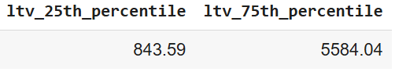
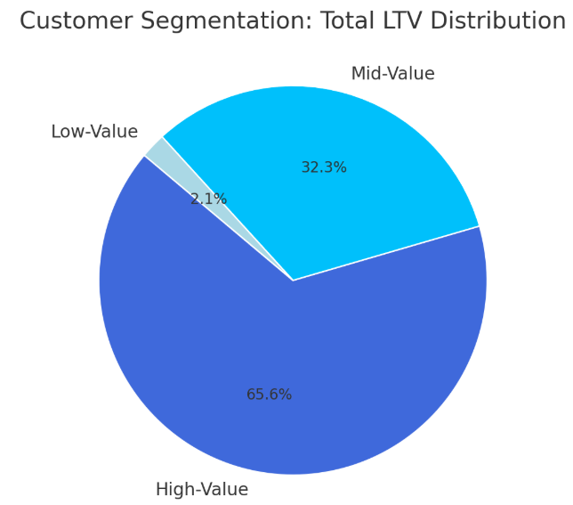
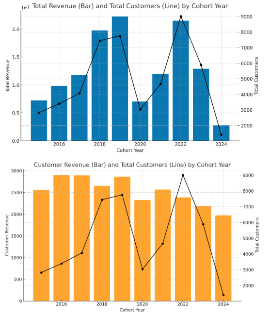
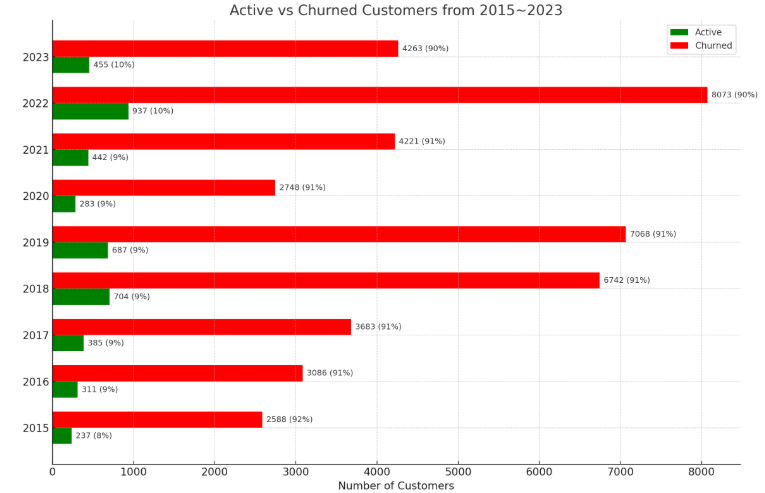

# Overview 
## Welcome to my Intermediate SQL Project!!! 
---
### For those already familiar with the fundamentals of SQL, this project serves as a transition into more advanced SQL concepts. It begins with setting up a database in Visual Studio Code, utilizing a connection to pgAdmin 4 for database management.
### The datasets used in this analysis are sourced from Luke Barousse's Intermediate SQL Course, which offers structured data tables and comprehensive information designed to support SQL-based data analysis.
[(Luke Barousse Intermediate SQL Source)](https://github.com/lukebarousse/Int_SQL_Data_Analytics_Course)

### Let start with the QUERY Clauses of which we learned from the basics of SQL:
- SELECT(DISTINCT)
- FROM
- WHERE
- GROUP BY 
- HAVING 
- ORDER BY
- JOINS
- LIMIT
- AGG FUNCTION (MAX, MIN, COUNT, SUM)   
### However, for a more advanced SQL of skills that we will be using in the workspace in the future and covering here are:
- CTE (cover a bit in last project)
- Subquery (cover a bit in last project)
- ROW NUMBER
- RANKING
- CONCAT

## Main Tools:
- **SQL(Structured Query Language)**: for interacting and communicating with relational databases
- PostgreSQL: The database management system, ideal for handling the job posting data
- **pgAdmin 4**: It's a graphical user interface (GUI) tool for managing PostgreSQL databases
- **Google Collab**: A free platform/tool for writing and executing SQL. No setup requried, with easy save and load notebooks from Drive.  
- **Visual Studio Code**: A powerful, lightweight, and highly customizable code editor that works great for a wide range of tasks. Contains connection with Github directly for users to upload their files. 
- **Github** - A platform that hosts Git repositories to store, share, and back up online.

## Business Questions
1. Customer Segentation: Who are our most valuable customers?
2. Cohort Analysis: How do different customer groups generate revenue?
3. Customer Retention: Which customers haven't purchased recently?

## Create View 
🖥️ Query: [Q0_Create_view](Q0_Create_View.sql)
- Combining data table from sales and customer tables into revenue metrics
- Obtaining the first purchased date from each customer
- Getting the cohort year based on their first purchased date for the company
- Including customer's info such as name, age, and country
- Creating a view of this whole query that including customer and purchase info

## Project Analysis
### 1. Customer Segmentation
🖥️ Query: [Q1 Customer Segmentation](Q1_Customer_Segmentation.sql)  

- Finding each customer lifetime value (LTV)  
(LTV: Customer total spent for the company)
- Assigned Customer in Low, Mid, and High value based on their LTV
- Using such info to assist us to understand all customer purchase behavior(how much spent?)

### The Low, Mid, High Values Comparison Line based on 25% and 75% of the total ltv

###  Categorize the total LTV (Adds up)
🖥️ Query: [Q1 Different Value Total LTV](Q1_Different_Value_Total_LTV_Bonus.sql)  

## 📈 Visualization:

### 📊Key Observations:
- High-value segment (25% of customers) drives 66% of revenue ($135.4M)
- Mid-value segment (50% of customers) generates 32% of revenue ($66.6M)
- Low-value segment (25% of customers) accounts for 2% of revenue ($4.3M)

### 2. Cohort Analysis
🖥️ Query: [Q2 Cohort Analysis](Q2_Cohort_Analysis.sql)

## 📊 Graph Analysis
### 1. Total Revenue(1e7) vs. Total Customers by Cohort Year
### Observation:

- Total Revenue increases consistently from 2015 to 2019.

- A huge drop of the total revenue and customers from 2019~2020, but rises up the next year to 2022

- Another huge decline form 2022~2024

- Total Customers also grows steadily over the same period, nearly tripling from ~2800 to ~7700+.

### Insight:

- The rising trend in both metrics suggests strong customer acquisition and revenue growth.

- The decline observed between 2019 and 2020 may be attributed to the impact of the COVID-19 pandemic.

- While the decline between 2019 and 2020 may be due to the effects of the COVID-19 pandemic, the significant downturn observed from 2022 to 2024 could be indicative of decreased revenue and a shrinking customer base. 

### 2. Customer Revenue vs. Total Customers by Cohort Year
###  Observation:

- Customer Revenue (i.e., revenue per customer) fluctuates slightly but remains relatively stable, ranging between ~2560 and ~2890.

- Despite growing total customers, the customer revenue doesn’t increase substantially, and even dips slightly in 2018.

- A key observation in 2024 is that, despite a smaller customer base, the average revenue per customer remains high—indicating that these customers are particularly valuable and contribute significantly to the company's earnings.

### Insight:

- While the business is scaling in customer count, the average revenue per customer is not significantly increasing.

- This could indicate market saturation, pricing stability, or a consistent product/service offering without upselling or increased customer engagement.

- Although the company is experiencing a decline in its customer base, the average revenue has remained relatively stable, suggesting that the remaining customers are highly engaged and continue to generate substantial value.

### 3. Customer Retention
🖥️ Query: [Q3 Customer Retention](Q3_Customer_Retention.sql)

## 📊 Graph Analysis: Active vs Churned Customers (2015–2023)
### 1. Overall Trend
- Across all cohort years, a **significant majority of customers are churned**, while only a **small proportion remains active**.

- The **active customer percentage consistently ranges between 6% and 10%**, indicating a relatively low long-term retention rate.

### 2. Active Customers
- Although the number of active customers slightly increases in later cohorts (e.g., 2022, 2023), this is largely **due to the larger total customer base** rather than improved retention.

- The **peak in active customer count** (not percentage) occurs in **2023**, reflecting more recent customer acquisition but not necessarily higher engagement or loyalty.

### 3. Churned Customers
- Churned customer numbers closely follow the total customer count pattern, showing the **dominance of churn** in every year.

- For instance, in earlier cohorts like 2015–2017, churned customers made up **over 90%** of the cohort.

### 4. Implications
- The consistently low retention percentage suggests that **customer engagement or satisfaction might need improvement**.

- The **high churn rate** implies either short-term customer relationships or potential gaps in product/service stickiness.

- Despite the increasing total customer base over time, the low retention rate limits long-term revenue sustainability unless offset by acquiring high-value customers (as seen in the customer revenue chart you analyzed earlier).
